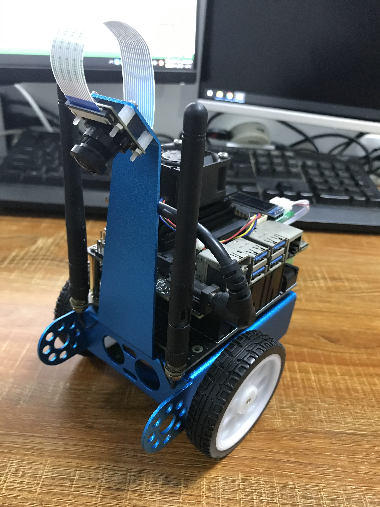

# JetBot 2.0

Jetbot 2.0 基于 Jetbot 的基础上进行改进的新版本，兼容 Jetbot 所有功能并增加以下新功能：

* 12V 锂电池电量检测并显示
* OLED 滚动显示，第二页正价电量显示，ADC 值显示，超声波测距显示正价，PWM 显示等等
* 增加 3 个 ADC 接口
* 增加 2 个 PWM 接口
* 增加 1 个 超声波接口
* 增加 1 个 IMU 接口
* 增加 1 个 USB 接口 (5V/6A 输出)
* 增加 1 个 5V 接口 (5V/6A 输出)
* 增加 1 个 DC 接口 (12.6V锂电池充电器充电输入， 或者 12V锂电池输出)
* 增加 胶棒天线安装孔位 
* 增加 锂电池保护和管理芯片，支持 5V6A 大电流输出，支持边冲边放，24小时待机不断电
* 改为铝合金外壳，坚硬耐摔
* 增加电源开关，电机开关，支持紧急停止运动

<a href="Jetbot2.0.jpg">

## 使用方法

使用方法有3种, 请根据实际情况使用：

1.如果你使用钛创客配置好的 Jetbot 2.0 镜像, 那么不需要安装操作，系统已经安装好 Jetbot 2.0 所有需要的软件。极力推荐新手使用该方法。下面是钛创客配置好镜像存放地址：

```
链接：https://pan.baidu.com/s/1VyomyQpsXcq_I-U2G5LCBg 提取码：2c2w  复制这段内容后打开百度网盘手机App，操作更方便哦
```

2.如果你已经安装了官方的 Jetbot, 并配置好了系统，那么请执行下面指令安装 Jetbot 2.0:

>```
>cd ~
>git clone https://github.com/timaker/jetbot2.git
>cd jetbot2
>sudo python3 setup.py install 
>```

3.如果你的镜像没有安装过Jetbot, 那么需要执行下面指令安装各种程序, 新手不推荐该方式

> ```
>cd ~
>git clone https://github.com/timaker/jetbot2.git
>./run-script-and-save-log.sh
> ```

## Jetbot 2.0 视频教程及资料

到网盘下载

```
链接：https://pan.baidu.com/s/1VyomyQpsXcq_I-U2G5LCBg 提取码：2c2w  复制这段内容后打开百度网盘手机App，操作更方便哦
```